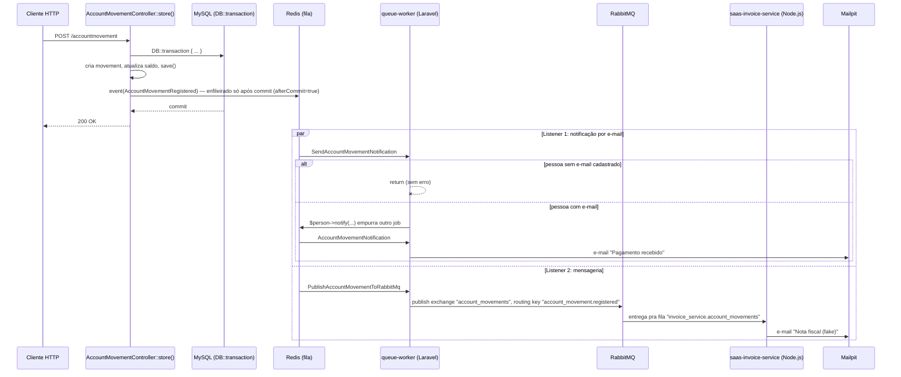

# Filas, Eventos e Mensageria

Quando uma baixa (pagamento/recebimento) é registrada em um título, duas
coisas acontecem de forma assíncrona, sem o cliente HTTP esperar por
nenhuma delas: um e-mail de notificação (via fila Redis) e uma mensagem
publicada no RabbitMQ, consumida por um **microsserviço separado, em
Node.js** (`saas-invoice-service`), que "envia" (fake) uma nota fiscal.

Este documento explica as duas coisas juntas porque elas nascem do mesmo
lugar: um único evento de domínio, `AccountMovementRegistered`, com dois
Listeners independentes reagindo a ele.

## Por que não fazer tudo direto no controller?

Dá pra fazer `Mail::send(...)` e a chamada HTTP pro RabbitMQ na mesma linha
do `save()`, e funcionaria — até a primeira vez que o SMTP ou o RabbitMQ
estiverem fora do ar durante uma requisição de pagamento, derrubando uma
operação financeira que já estava salva no banco.

A solução é separar **"registrar a baixa"** (rápido, crítico, síncrono) de
**"avisar alguém que isso aconteceu"** (mais lento, não crítico, pode rodar
depois, pode tentar de novo se falhar).

## As peças

| Peça | Tipo | Onde mora | O que faz |
|---|---|---|---|
| `AccountMovementRegistered` | Event | [app/Events/AccountMovementRegistered.php](../app/Events/AccountMovementRegistered.php) | Só carrega os dados (`$accountMovement`, `$account`, `$tpMovement`). Não faz nada sozinho. |
| `SendAccountMovementNotification` | Listener | [app/Listeners/SendAccountMovementNotification.php](../app/Listeners/SendAccountMovementNotification.php) | Decide **se** deve notificar e **quem**. Roda na fila (Redis). |
| `AccountMovementNotification` | Notification | [app/Notifications/AccountMovementNotification.php](../app/Notifications/AccountMovementNotification.php) | Sabe **como** montar o e-mail. Também roda na fila. |
| `Person` (`Notifiable`) | Model | [core/Models/Person.php](../core/Models/Person.php) | Sabe **para onde** mandar (`routeNotificationForMail`). |
| `PublishAccountMovementToRabbitMq` | Listener | [app/Listeners/PublishAccountMovementToRabbitMq.php](../app/Listeners/PublishAccountMovementToRabbitMq.php) | Publica a baixa no RabbitMQ, pra qualquer serviço externo (qualquer linguagem) reagir sem acoplamento nenhum com este código. |
| `RabbitMqConnectionFactory` | Service | [app/Services/RabbitMq/RabbitMqConnectionFactory.php](../app/Services/RabbitMq/RabbitMqConnectionFactory.php) | Único lugar que monta a conexão AMQP, lendo de `config('services.rabbitmq.*')`. |
| `saas-invoice-service` | Repo irmão | `../saas-invoice-service` | Node.js (`amqplib` + `nodemailer`). Não importa nada do Laravel — só concorda no exchange e no formato do JSON. |

## O fluxo completo



Pontos-chave desse diagrama:

1. **A resposta HTTP volta pro cliente antes de qualquer uma das duas
   coisas ser processada.** `event()` só empurra job(s) pro Redis — quem
   efetivamente executa é o `queue-worker`, um container/processo
   separado. Um breakpoint dentro de um Listener nunca pausa durante a
   requisição HTTP.
2. **São três jobs no Redis, não um**: o Listener do e-mail, a Notification
   (que o Listener dispara), e o Listener que publica no RabbitMQ — os três
   independentes entre si. Se um falhar, os outros não são afetados.
3. **Dois Listeners reagem ao mesmo evento** sem um saber da existência do
   outro — é o padrão "um evento, múltiplos listeners". O Laravel descobre
   os dois automaticamente (ver seção abaixo).
4. **O RabbitMQ é só mais um assinante.** Do ponto de vista do
   `AccountMovementController`, publicar no Redis (pro e-mail) e publicar
   no RabbitMQ (pro `saas-invoice-service`) são a mesma coisa: `event()`
   dispara os dois, cada Listener decide o que fazer com a informação.

## Como o Laravel liga o Event aos Listeners

Não existe nenhum `Event::listen(...)` registrado em lugar nenhum do
código. O Laravel **descobre automaticamente** que um Listener escuta
`AccountMovementRegistered` porque:

- o Listener está dentro de `app/Listeners/`;
- o método `handle()` do Listener tem `AccountMovementRegistered` como tipo
  do parâmetro.

Isso vale pra quantos Listeners você quiser — é assim que
`SendAccountMovementNotification` e `PublishAccountMovementToRabbitMq`
convivem sem um saber do outro. Se você criar um novo Listener e ele não
estiver sendo chamado, rode `php artisan optimize:clear` (pode haver cache
de uma execução anterior com `event:cache`).

## O bug que corrigimos no caminho: `afterCommit`

Rotas que escrevem no banco (`POST`/`PUT`/`PATCH`/`DELETE`) rodam dentro de
`DB::transaction()` explícito no Controller/Service (existia uma middleware
global fazendo isso antes; foi removida — cada Controller/Service usa
`DB::transaction()` só onde precisa de atomicidade de verdade).

Sem `afterCommit = true` no Listener, o Laravel empurra o job pra fila
**imediatamente** quando `event()` é chamado, mesmo que a transação ainda
não tenha commitado. Se a transação der rollback depois (ex: o segundo item
de um lote de baixas falha), a notificação/mensagem do primeiro item **já
teria saído** mesmo com os dados desfeitos no banco — um "dual write" entre
o banco e a fila.

`public bool $afterCommit = true;` nos dois Listeners resolve isso: o
Laravel só enfileira de fato depois que a transação commitar, e cancela o
dispatch se ela der rollback. Validamos isso na prática: simulamos uma
transação que dá rollback depois do `event()` e confirmamos que **nenhum**
job novo apareceu nem no `queue-worker` nem no `saas-invoice-service`.

## A infraestrutura (docker-compose)

Definido em `saas-docker/docker-compose.yml`:

| Container | Papel |
|---|---|
| `backend` | Recebe a requisição HTTP, roda o `store()`, dispara `event()`. |
| `redis` | Fila interna do Laravel. Guarda os jobs até o worker processar. |
| `queue-worker` | Mesma imagem do `backend`, roda `php artisan queue:work redis` em loop. É quem executa os Listeners de verdade. |
| `rabbitmq` | Broker de mensageria (AMQP). Painel de management em [http://localhost:15672](http://localhost:15672) (guest/guest). |
| `invoice-service` | O `saas-invoice-service` (Node.js), consumer real e independente do RabbitMQ. |
| `mailpit` | SMTP fake local. Inbox web em [http://localhost:8025](http://localhost:8025). Nenhum e-mail real sai daqui — tanto o Laravel quanto o Node mandam pra cá em dev. |

**Ponto chave:** `backend` e `queue-worker` são dois processos PHP
independentes, cada um com seu próprio ciclo de vida — se você mexer no
código de um Listener e o `queue-worker` não pegar a mudança, é porque ele
não foi reiniciado.

## Vocabulário do RabbitMQ

Só existe na metade do fluxo que fala com o RabbitMQ — não tem equivalente
na fila do Laravel:

| Conceito | O que é | Equivalente na fila do Laravel (Redis) |
|---|---|---|
| Producer | Quem publica a mensagem | `event()` / `dispatch()` |
| Exchange | Recebe a mensagem e decide **para quais filas** ela vai | Não existe — no Redis cai direto numa lista |
| Routing key | Rótulo que a mensagem carrega (ex: `account_movement.registered`) | Não existe |
| Binding | Regra que liga uma fila a um exchange, por um padrão de routing key | Não existe |
| Queue | Onde a mensagem fica esperando | A lista do Redis |
| Consumer | Quem processa | O `queue-worker` |

A diferença central: no Redis, o Producer já sabe pra qual fila o job vai.
No RabbitMQ, o Producer só publica com um rótulo — quem decide o roteamento
é o Exchange, com base nos Bindings que os Consumers criaram. O Producer
nem precisa saber que os Consumers existem — é exatamente essa a relação
entre `PublishAccountMovementToRabbitMq` (Laravel) e o
`saas-invoice-service` (Node).

## Por que RabbitMQ existe aqui (e por que quase não deveria)

Importante deixar registrado: **num monólito sem nenhum outro consumidor
real, publicar no RabbitMQ não resolve nenhum problema que a fila Redis já
não resolvesse.** Isso foi feito para fins de estudo — pra ter o mecanismo
pronto e entendido — não porque o sistema precisasse disso hoje. Um
revisor sênior estaria certo em questionar isso num code review real se não
houvesse um segundo consumidor de verdade. É por isso que existe o
`saas-invoice-service`: sem ele, esse RabbitMQ estaria publicando pra
ninguém.

RabbitMQ compensa quando existe **de fato** outro serviço/linguagem/time
consumindo — é exatamente esse o cenário que o `saas-invoice-service`
simula.

## Lição operacional: fila sem consumer é vazamento

Chegamos a ter um comando artisan só pra demonstrar como um consumer
funciona por dentro. Ele declarava uma fila **durável e nomeada**, ligada
ao mesmo exchange/padrão de routing key do fluxo real. Resultado: toda
baixa real também caía nessa fila de demo, e como ninguém ficava rodando o
comando o tempo todo, as mensagens só se acumulavam ali — chegamos a achar
mensagens paradas com **zero consumers** no painel do RabbitMQ.

Removemos o comando (e a fila, via API de management) porque o
`saas-invoice-service` já é um consumer de verdade, sempre no ar. A lição
que fica: **toda fila durável precisa de alguém consumindo ativamente, ou
de uma política de expiração** (`x-message-ttl`, `x-expires`, ou uma fila
`exclusive`/`auto_delete` pra consumers só-de-teste). Uma fila esquecida
não dá erro nenhum — só cresce, silenciosamente, até virar um problema de
disco/memória no broker.

## Troubleshooting

**"Não chegou o e-mail"** — siga essa ordem:

1. **O evento realmente disparou?** Breakpoint/log na linha
   `event(new AccountMovementRegistered(...))` em
   [AccountMovementController.php](../app/Http/Controllers/AccountMovementController.php).
2. **Os containers estão de pé?**
   ```bash
   docker ps --format "table {{.Names}}\t{{.Status}}" | grep -E "redis|queue-worker|rabbitmq|invoice-service|mailpit"
   ```
3. **O worker processou os jobs esperados?**
   ```bash
   docker logs queue-worker --tail 20
   ```
   Só uma linha `DONE` do Listener, sem a segunda linha da Notification, é
   o sintoma mais comum: **a pessoa vinculada à conta não tem `ds_email`
   cadastrado**, e o guard em `SendAccountMovementNotification` sai
   silenciosamente sem lançar erro. Proposital — mas fácil de confundir com
   "a fila não está funcionando".
4. **Algum job falhou de verdade?**
   ```bash
   php artisan queue:failed
   ```
   Stack trace completo com `DB::table('failed_jobs')->latest('id')->first()->exception`.
5. **Está olhando o lugar errado?** Em dev, `MAIL_MAILER=smtp` aponta pro
   Mailpit, não pro seu e-mail de verdade — [http://localhost:8025](http://localhost:8025).

**"Não chegou a mensagem no RabbitMQ/invoice-service"**:

1. `docker logs invoice-service --tail 20` — ele loga toda mensagem
   recebida e todo envio de e-mail.
2. Painel do RabbitMQ ([http://localhost:15672](http://localhost:15672)) →
   aba **Exchanges** → `account_movements` → confira os bindings; e aba
   **Queues** → `invoice_service.account_movements` deve mostrar
   `consumers: 1`. Se mostrar `0`, o container `invoice-service` não está
   rodando ou perdeu a conexão.

## Como estender esse padrão para um novo evento

Exemplo: notificar quando uma baixa é **estornada**
(`storePaymentReversal()`), que hoje não dispara nada.

1. Criar `App\Events\AccountMovementReversed` (ou reaproveitar
   `AccountMovementRegistered` com uma flag) — deve carregar só os dados,
   sem lógica.
2. Criar um Listener em `app/Listeners` com `implements ShouldQueue`,
   `afterCommit = true` e um `handle(AccountMovementReversed $event)`.
3. Disparar com `event(new AccountMovementReversed(...))` dentro da
   `DB::transaction()` de `storePaymentReversal()`.
4. Escrever um teste em `tests/Feature` seguindo o padrão de
   [AccountMovementNotificationTest.php](../tests/Feature/AccountMovementNotificationTest.php)
   — testa a "cola" entre as peças sem precisar subir containers nem
   tocar o banco.

## Como rodar a demonstração completa

```bash
docker compose up -d
docker compose logs -f invoice-service
```

Registre uma baixa de verdade pela API (ou via tinker). Em segundos você
deve ver, na inbox do Mailpit ([http://localhost:8025](http://localhost:8025)),
**dois e-mails** pro mesmo cliente: um do Laravel ("Pagamento recebido"),
outro do `saas-invoice-service` ("Nota fiscal (fake)") — dois processos,
duas linguagens, nenhum acoplamento entre si além do RabbitMQ.
